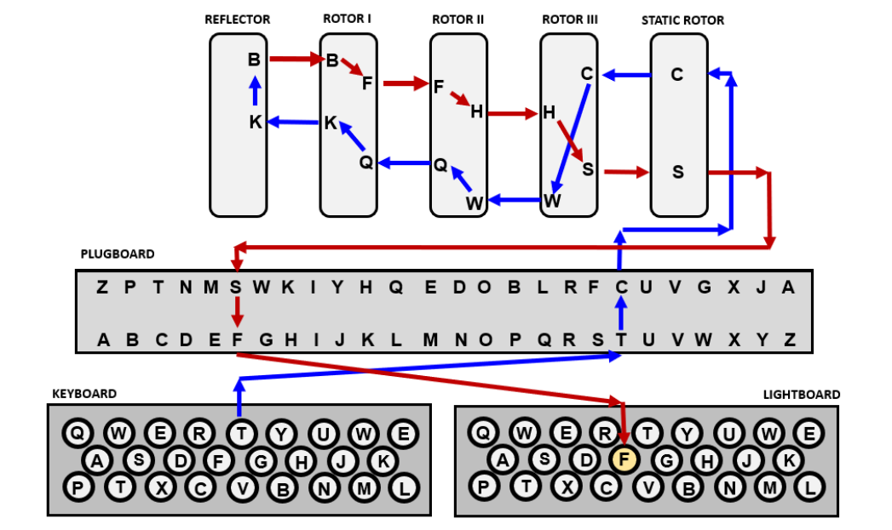

# World War 2.1 - Enigma Deciphering Project

## Overview

Welcome to World War 2.1, a Java project that simulates the process of deciphering encrypted messages during World War II. You find yourself in the midst of the war, aiming to intercept and decode the Axis powers' encrypted communications to thwart their plans. After intercepting samples of their encrypted messages, it becomes evident that the Germans are using the Enigma machine to encrypt their messages. Teaming up with Alan Turing and a group of elite codebreakers, your mission is to break the Enigma cipher and decode the German messages to counter their strategies.

## Enigma Machine Components

### Keyboard
The input device where each pressed key initiates the encoding process for the corresponding letter.

### Plugboard
A panel in front of the machine with letters A-Z, connected in pairs using 8 wires. It swaps letters in pairs before and after processing through the rotors.

### Fixed Rotor
A static rotor relative to which three moving rotors rotate.

### Moving Rotors
Three rotors, each containing a permutation of the letters A-Z, which rotate to create a variable electrical circuit. The first rotor completes one full turn to advance the second rotor by one position, and similarly, the second rotor advances the third rotor.

### Reflector
Maps each input letter to another letter and sends it back through the rotors, following the reverse path to the plugboard.

### Lampboard
Lights up the final encoded letter after the encoding process.

## Project Functionality

The project involves the following tasks:
1. **Initialization**: Setting up the Enigma machine based on the daily rotor configurations and plugboard settings.
2. **Encoding**: Simulating the Enigma machine's encoding process for a given input.
3. **Decoding**: Reversing the encoding process to retrieve the original message.

### Enigma Configuration Example

Given the Enigma machine setup on `yyyy/mm/dd`:
- **Plugboard**: {AF, BM, GH, JC, XE, OP, NR, ZL}
- **Reflector**: A to Z, B to Y, C to X, etc.
- **Rotor 3**: {LUWJHIKDYCAXMNQBZTRFGESVPO}
- **Rotor 2**: {QNGHSZAFEBJRLUCTXYIMPDWKOV}
- **Rotor 1**: {CMFQSBHIOAKRTENZLDYWUGPJXV}

#### Encoding Example
Input: `AB`
1. The first letter 'A' is processed through the plugboard, rotors, reflector, and back through the rotors and plugboard.
   - **Output**: `G`
2. The first rotor advances by one position: {OLUWJHIKDYCAXMNQBZTRFGESVP}.
3. The second letter 'B' is processed similarly.
   - **Output**: `H`
4. The final encoded output: `GH`

## Usage

1. **Input**: An encrypted message and a configuration file specifying the daily setup for the Enigma machine.
2. **Output**: The decoded original message.

### Configuration File
The configuration file includes:
- Rotor types and their wiring permutations.
- Plugboard pairings.
- Reflector mapping.
- Initial rotor settings for each date.

### Running the Project
1. Initialize the Enigma machine with the configuration settings.
2. Input the encrypted message.
3. The program processes each character through the Enigma machine.
4. Display the decoded message.
